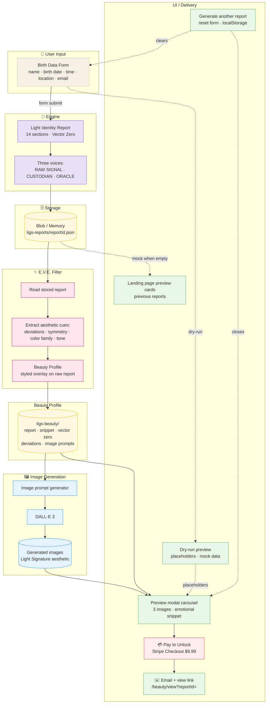
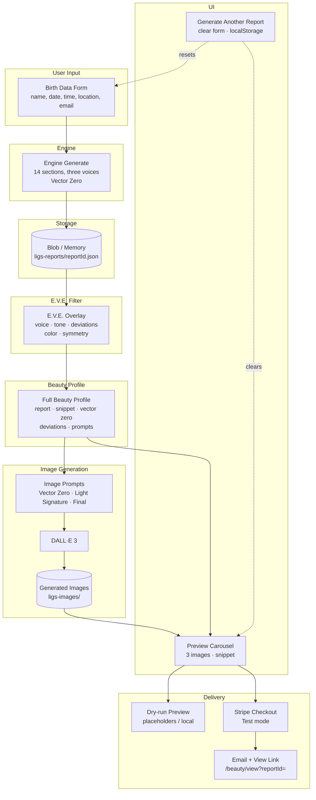

# Beauty Flow Diagram

End-to-end pipeline showing how user input moves through the LIGS engine, E.V.E., image generation, storage, and delivery.

---

## Visual Flow Diagram

Flowchart with color-coded stages and icons. Solid arrows = main flow; dashed = dry-run / testing.



### Color legend

| Stage | Color | Purpose |
|-------|-------|---------|
| **Input / User** | Soft cream `#f5f0e6` | Birth data entry |
| **Engine / AI** | Violet `#e8e0f5` | Scientific / report generation |
| **Storage** | Amber tint `#fff8e1` | Blob / memory |
| **E.V.E. / Beauty Profile** | Blush / pastel `#fce4ec` | Stylized overlay |
| **Images** | Blue `#e3f2fd` | Image generation |
| **UI / Delivery** | Green `#e8f5e9` | Actions, email, carousel |
| **Stripe** | Red tint `#ffebee` | Pay to Unlock button |

### Optional paths

- **Dry-run**: Dashed line from `Dry-run preview` → carousel (placeholders, no Blob/Stripe).
- **Landing preview cards**: Dashed line from Blob (mock data when empty).
- **Generate another report**: Dashed reset to form and carousel.

---

## Overview



---

## Detailed Flow

```mermaid
flowchart LR
    subgraph "1. Submission"
        A1[User submits<br/>birth data]
    end

    subgraph "2. Engine"
        A2[POST /api/engine/generate]
        A3[OpenAI → 14 sections<br/>three voices · Vector Zero]
        A4[saveReportAndConfirm]
    end

    subgraph "3. Storage"
        A5[(Blob<br/>full_report · snippet<br/>image_prompts · vector_zero)]
    end

    subgraph "4. E.V.E."
        A6[POST /api/engine<br/>E.V.E. pipeline]
        A7[Read report · no overwrite]
        A8[E.V.E. filter overlays<br/>style · voice · deviations]
        A9[saveBeautyProfileV1]
    end

    subgraph "5. Beauty Profile"
        A10[(Blob ligs-beauty/)]
        A11[subjectName · emotionalSnippet<br/>voice · tone · color · symmetry<br/>imagery prompts]
    end

    subgraph "6. Images"
        A12[Image prompts → DALL·E 3]
        A13[(ligs-images/)]
    end

    subgraph "7. Delivery"
        A14{Dry-run?}
        A15[Preview only<br/>placeholders]
        A16[Pay to unlock<br/>Stripe Checkout]
        A17[Webhook → Email<br/>/beauty/view link]
    end

    A1 --> A2
    A2 --> A3
    A3 --> A4
    A4 --> A5
    A5 --> A6
    A6 --> A7
    A7 --> A8
    A8 --> A9
    A9 --> A10
    A10 --> A11
    A11 --> A12
    A12 --> A13
    A13 --> A14
    A14 -->|yes| A15
    A14 -->|no| A16
    A16 --> A17
```



---

## Key Concepts

| Element | Purpose |
|---------|---------|
| **Engine** | Generates Light Identity Report (14 sections, three-voice structure). Output: `full_report`, `emotional_snippet`, `image_prompts`, `vector_zero`. |
| **E.V.E.** | Overlays style/voice on raw report. Produces: voice, tone, deviations, color, symmetry. Unifies three voices into one stylized voice for UI. |
| **Beauty Profile** | Full artifact: original report, emotional snippet, Vector Zero, deviations, image prompts. Stored in Blob; required for Stripe checkout. |
| **Images** | DALL·E 3 generates images from prompts. Reflect user's Light Signature aesthetic. Three fields: Vector Zero, Light Signature, Final Beauty. |
| **Dry-run** | Uses placeholders; no Blob write, no Stripe. For local/testing. |
| **Generate another report** | Resets form, clears localStorage, closes preview modal. |

---

## API Entry Points

```mermaid
flowchart TB
    subgraph FRONTEND
        F1[/ or /beauty]
        F2[LandingPreviews<br/>/api/report/previews]
        F3[PayUnlockButton<br/>or modal Proceed]
    end

    subgraph API
        E1[POST /api/engine/generate]
        E2[POST /api/engine]
        B1[POST /api/beauty/create]
        B2[POST /api/beauty/dry-run]
        R1[GET /api/report/reportId]
        S1[POST /api/stripe/create-checkout-session]
        W1[POST /api/stripe/webhook]
    end

    F1 -->|form submit| E1
    F1 -->|form submit| E2
    B1 --> E2
    B2 --> E1
    F2 --> R1
    F3 --> S1
    S1 -->|success| Stripe
    Stripe[Stripe Checkout] -->|webhook| W1
    W1 --> Email[Email API]
```

---

## Notes

- **Three-voice structure** is preserved in the report; E.V.E. unifies into a single stylized voice for the Beauty Profile UI.
- **Images** reflect the user's Light Signature aesthetic (color, symmetry, emotional resonance).
- **Dry-run mode** uses placeholders when Blob is empty or `dryRun=true`; no Beauty Profile is created, so Stripe checkout returns 404 with a friendly message.
- **localStorage** persists `lastFormData` for PayUnlockButton; "Generate another report" clears it.
